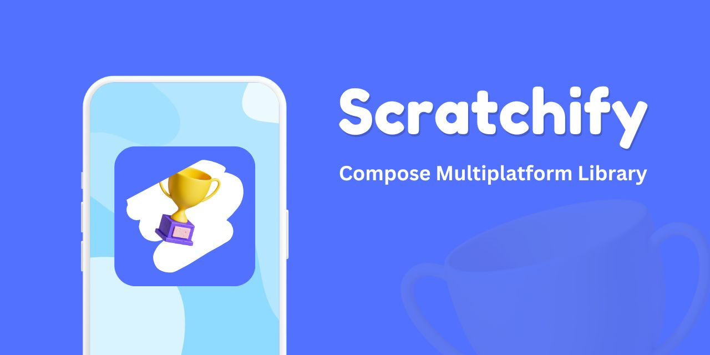

# Scratchify - A Compose Multiplatform Scratch Card SDK




[](https://github.com/gsrathoreniks)
[](https://twitter.com/gsrathoreniks)

<a href="https://www.producthunt.com/products/scratchify-sdk-mobile-scratch-rewards?embed=true&utm_source=badge-featured&utm_medium=badge&utm_source=badge-scratchify&#0045;sdk&#0045;mobile&#0045;scratch&#0045;rewards" target="_blank"></a>

[](https://androidweekly.net/issues/issue-667)

---

## 🚀 Introduction

Scratchify is a powerful and highly customizable scratch card SDK built using Jetpack Compose Multiplatform. It enables you to create engaging interactive scratch surfaces where users can scratch off an overlay to reveal hidden content underneath. Perfect for reward systems, discount reveals, surprise elements, and gamification in your modern apps!

Perfect for:  
✅ **Reward reveals & lottery systems**  
✅ **Discount coupons & promotional codes**  
✅ **Interactive surprise elements**  
✅ **Gamification features & mini-games**  
✅ **Educational apps & learning activities**  
✅ **User engagement & retention strategies**

---

## ✨ Features

### 🎯 Core Features
✔️ **Multiplatform support** (Android & iOS)  
✔️ **Two-layer scratch surface** (Overlay & Revealed Content)  
✔️ **Customizable brush configuration** (size, color, opacity)  
✔️ **Auto-reveal after threshold** (configurable percentage)  
✔️ **Scratch event callbacks** (`onScratchStarted`, `onScratchProgress`, `onScratchCompleted`)  

### 🚀 Advanced Features
✔️ **Instant reveal & reset functionality**  
✔️ **Tap-to-scratch detection** alongside drag gestures  
✔️ **Configurable grid resolution** for performance optimization  
✔️ **Save & restore scratch state** for persistent experiences  
✔️ **Cross-platform haptic feedback** (iOS & Android)  
✔️ **Animated reveal effects** (fade, scale, slide, bounce, zoom)  
✔️ **Custom brush shapes** (circle, square, star, heart, diamond, custom paths)  
✔️ **Transparent & colored brush modes** (traditional scratch or paint effects)  

---

## 📦 Implementation

### 1️⃣ Add Dependency

Since **Scratchify** is a Compose Multiplatform (CMP) library, you should add it to your **`commonMain`** source set to use it across both iOS and Android.

Add the dependency in your `shared` module's `build.gradle.kts`:

[](https://central.sonatype.com/search?q=io.github.gsrathoreniks.scratchify)  
```kotlin
dependencies {
    implementation("io.github.gsrathoreniks:scratchify:<latest_version>")
}
```

### 2️⃣ Basic Usage

```kotlin
import com.gsrathoreniks.scratchify.api.Scratchify
import com.gsrathoreniks.scratchify.api.ScratchifyController
import com.gsrathoreniks.scratchify.api.config.ScratchifyConfig

@Composable
fun BasicScratchCard() {
    val controller = remember { ScratchifyController() }
    
    Scratchify(
        modifier = Modifier.size(300.dp, 200.dp),
        config = ScratchifyConfig(),
        controller = controller,
        contentToReveal = {
            Box(
                modifier = Modifier
                    .fillMaxSize()
                    .background(Color(0xFFFFD700)),
                contentAlignment = Alignment.Center
            ) {
                Text("🎉 You Won! 🎉", style = MaterialTheme.typography.headlineMedium)
            }
        },
        overlayContent = {
            Box(
                modifier = Modifier
                    .fillMaxSize()
                    .background(Color(0xFF8E24AA)),
                contentAlignment = Alignment.Center
            ) {
                Text("Scratch Here!", color = Color.White)
            }
        }
    )
}
```

### 3️⃣ Advanced Configuration

```kotlin
@Composable
fun AdvancedScratchCard() {
    val controller = remember { 
        ScratchifyController(
            ScratchifyConfig(
                // Core settings
                revealFullAtPercent = 0.6f,
                gridResolution = 100,
                enableTapToScratch = true,
                
                // Brush configuration
                brushConfig = ScratchifyBrushConfig(
                    brushSize = 30.dp,
                    brushColor = Color.Red,
                    opacity = 0.8f,
                    brushShape = BrushShape.Star(points = 5)
                ),
                
                // Haptic feedback
                hapticConfig = ScratchifyHapticConfig(
                    isEnabled = true,
                    onScratchStarted = HapticFeedbackType.LIGHT,
                    onScratchProgress = HapticFeedbackType.LIGHT,
                    onScratchCompleted = HapticFeedbackType.SUCCESS,
                    progressHapticInterval = 0.25f
                ),
                
                // Animation effects
                animationConfig = ScratchifyAnimationConfig(
                    revealAnimationType = RevealAnimationType.BOUNCE,
                    animationDurationMs = 800,
                    enableProgressAnimation = true
                )
            )
        )
    }
    
    // Controller API usage
    Row {
        Button(onClick = { controller.revealInstantly() }) {
            Text("Reveal")
        }
        Button(onClick = { controller.resetScratch() }) {
            Text("Reset")
        }
    }
    
    Scratchify(
        modifier = Modifier.size(300.dp, 200.dp),
        config = controller.config,
        controller = controller,
        contentToReveal = { /* Your content */ },
        overlayContent = { /* Your overlay */ }
    )
}
```

## 🎨 Configuration Options

### Core Configuration (`ScratchifyConfig`)
| Parameter | Type | Default | Description |
|-----------|------|---------|-------------|
| `revealFullAtPercent` | `Float` | `0.75f` | Auto-reveal threshold (0.0 to 1.0) |
| `isScratchingEnabled` | `Boolean` | `true` | Enable/disable scratching |
| `gridResolution` | `Int` | `150` | Grid resolution for performance tuning |
| `enableTapToScratch` | `Boolean` | `true` | Allow single taps to create scratches |

### Brush Configuration (`ScratchifyBrushConfig`)
| Parameter | Type | Default | Description |
|-----------|------|---------|-------------|
| `brushSize` | `Dp` | `4.dp` | Size of the brush stroke |
| `brushColor` | `Color` | `Color.Cyan` | Brush color (`Color.Transparent` for traditional scratch) |
| `opacity` | `Float` | `1f` | Brush opacity (0.0 to 1.0) |
| `brushShape` | `BrushShape` | `BrushShape.Circle` | Shape of the brush stroke |

### Brush Shapes (`BrushShape`)
- `BrushShape.Circle` - Classic circular brush
- `BrushShape.Square` - Square brush strokes  
- `BrushShape.Star(points: Int = 5)` - Star-shaped brush
- `BrushShape.Heart` - Heart-shaped brush
- `BrushShape.Diamond` - Diamond-shaped brush
- `BrushShape.Custom(path: Path, size: Dp)` - Custom path shapes

### Haptic Feedback (`ScratchifyHapticConfig`)
| Parameter | Type | Default | Description |
|-----------|------|---------|-------------|
| `isEnabled` | `Boolean` | `true` | Enable haptic feedback |
| `onScratchStarted` | `HapticFeedbackType` | `LIGHT` | Feedback when scratching begins |
| `onScratchProgress` | `HapticFeedbackType` | `NONE` | Feedback during scratching |
| `onScratchCompleted` | `HapticFeedbackType` | `SUCCESS` | Feedback when completed |
| `progressHapticInterval` | `Float` | `0.25f` | Progress interval for haptic feedback |

### Animation Effects (`ScratchifyAnimationConfig`)
| Parameter | Type | Default | Description |
|-----------|------|---------|-------------|
| `revealAnimationType` | `RevealAnimationType` | `FADE` | Type of reveal animation |
| `animationDurationMs` | `Int` | `500` | Animation duration in milliseconds |
| `enableProgressAnimation` | `Boolean` | `true` | Enable progress animations |

### Animation Types (`RevealAnimationType`)
- `NONE` - No animation
- `FADE` - Fade out effect
- `SCALE` - Scale down effect  
- `SLIDE_UP` - Slide up and disappear
- `SLIDE_DOWN` - Slide down and disappear
- `SLIDE_LEFT` - Slide left and disappear
- `SLIDE_RIGHT` - Slide right and disappear
- `BOUNCE` - Bouncy scale effect
- `ZOOM_OUT` - Zoom out effect

## 🎮 Controller API

The `ScratchifyController` provides programmatic control over the scratch card:

```kotlin
val controller = remember { ScratchifyController() }

// Instant actions
controller.revealInstantly()  // Reveal content immediately
controller.resetScratch()     // Reset to initial state

// State management
val state = controller.saveState()        // Save current scratch state
controller.restoreState(state)            // Restore saved state

// Progress monitoring
val progress = controller.scratchProgress // Current scratch progress (0.0 to 1.0)
```

## 🔄 Migration from Previous Versions

### Brush Color/Opacity
- Use `Color.Transparent` for traditional scratch-off behavior
- Use any other color for paint/overlay effects
- Combine with `opacity` for semi-transparent effects

### Performance Optimization
- Lower `gridResolution` (75-100) for better performance on complex layouts
- Higher `gridResolution` (150-200) for more precise scratch detection

## 🎯 Example Use Cases

### 🎲 Lottery & Gaming
```kotlin
Scratchify(
    config = ScratchifyConfig(
        revealFullAtPercent = 0.8f,
        brushConfig = ScratchifyBrushConfig(brushSize = 25.dp),
        hapticConfig = ScratchifyHapticConfig(
            onScratchCompleted = HapticFeedbackType.SUCCESS
        ),
        animationConfig = ScratchifyAnimationConfig(
            revealAnimationType = RevealAnimationType.BOUNCE
        )
    ),
    contentToReveal = { LotteryPrizeContent() },
    overlayContent = { LotteryTicketOverlay() }
)
```

### 🎨 Creative Paint Mode
```kotlin
Scratchify(
    config = ScratchifyConfig(
        brushConfig = ScratchifyBrushConfig(
            brushSize = 35.dp,
            brushColor = Color.Magenta,
            opacity = 0.7f,
            brushShape = BrushShape.Star(points = 6)
        )
    ),
    contentToReveal = { CanvasBackground() },
    overlayContent = { PaintSurface() }
)
```

### 📱 Mobile Engagement
```kotlin
Scratchify(
    config = ScratchifyConfig(
        enableTapToScratch = true,
        gridResolution = 100, // Optimized for mobile
        hapticConfig = ScratchifyHapticConfig(
            progressHapticInterval = 0.3f
        )
    ),
    contentToReveal = { RewardContent() },
    overlayContent = { EngagementOverlay() }
)
```

## 🛠 Platform Support

| Platform | Haptic Feedback | Performance | Status |
|----------|----------------|-------------|---------|
| Android | ✅ Full Support | ⚡ Optimized | ✅ Stable |
| iOS | ✅ Full Support | ⚡ Optimized | ✅ Stable |

### Platform-Specific Features

**Android:**
- Vibrator API integration
- Pattern-based haptic feedback
- Performance optimizations for various device types

**iOS:**
- UIImpactFeedbackGenerator support
- UINotificationFeedbackGenerator for success/error
- Native iOS haptic patterns

## 📊 Performance Tips

1. **Grid Resolution:** Lower values (75-100) for better performance
2. **Brush Size:** Larger brushes require fewer touch points
3. **Haptic Intervals:** Increase interval (0.3f+) to reduce battery usage
4. **Animation Duration:** Shorter animations (300-500ms) feel more responsive

## 🎮 Advanced Features Guide

### State Persistence
```kotlin
// Save current scratch progress
val scratchState = controller.saveState()
// Later restore the exact same state
controller.restoreState(scratchState)
```

### Custom Brush Shapes
```kotlin
val customPath = Path().apply {
    // Define your custom shape
    moveTo(-10f, -10f)
    lineTo(10f, -10f)
    lineTo(0f, 10f)
    close()
}

ScratchifyBrushConfig(
    brushShape = BrushShape.Custom(customPath, 30.dp)
)
```

### Performance Monitoring
```kotlin
val controller = remember { ScratchifyController() }

// Monitor progress in real-time
LaunchedEffect(controller.scratchProgress) {
    println("Scratch progress: ${(controller.scratchProgress * 100).toInt()}%")
}
```

---

## 🤝 Contributing  

We welcome contributions from the community! 🚀  

### 🛠 Submitting Issues & Feature Requests  
- Found a **bug**? **[Open an Issue](https://github.com/gsrathoreniks/scratchify/issues/new?labels=bug&template=bug_report.md)**  
- Have a **feature request**? **[Suggest a Feature](https://github.com/gsrathoreniks/scratchify/issues/new?labels=enhancement&template=feature_request.md)**  

### 💡 Development Setup
1. Clone the repository
2. Open in Android Studio
3. Run the sample app to see all features in action

We appreciate your help in improving **Scratchify**! 🎉  

---

## 📜 License  

This project is licensed under the **MIT License**.  

📄 **Read the full license**: [MIT License](https://github.com/gsrathoreniks/scratchify/blob/master/LICENSE)  

---

## 🙏 Acknowledgments

- Built with ❤️ using Jetpack Compose Multiplatform
- Haptic feedback implementation inspired by platform best practices
- Animation system leveraging Compose's powerful animation APIs
- Performance optimizations based on real-world usage patterns

---

**Made with ❤️ for the Compose Multiplatform community**

